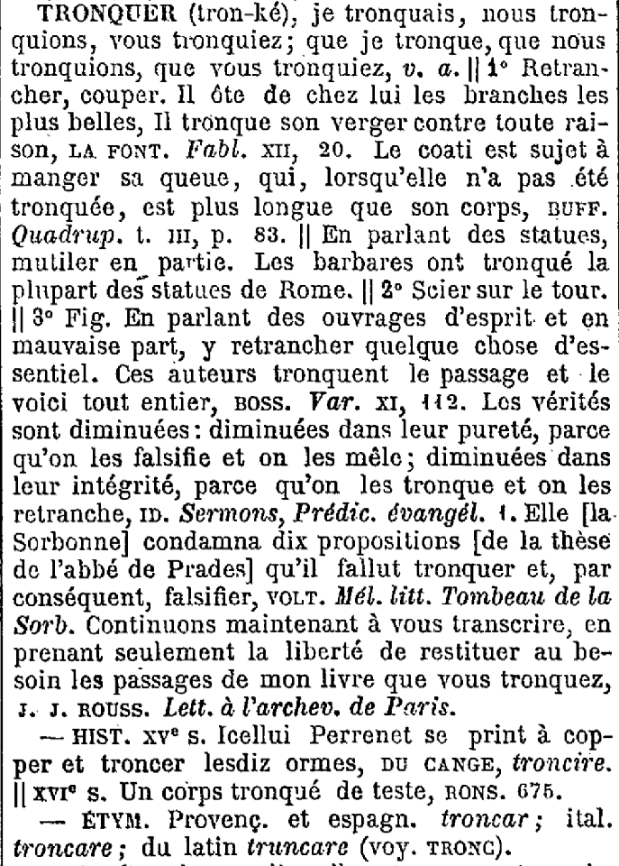

# Deep-Littré

[](https://github.com/myersm0/deep-littre/actions/workflows/CI.yml)
[](https://github.com/myersm0/deep-littre/releases/latest)

Émile Littré's *Dictionnaire de la langue française* is a dictionary in four volumes plus a supplement, published from 1872 to 1877. It survives in digitized form thanks to François Gannaz's [XMLittré](https://bitbucket.org/Mytskine/xmlittre-data), an XML transcription of all 78,599 entries.

Deep-Littré is a new edition built on top of XMLittré. It takes Gannaz's XML, works out even more of the structure from Littré's printed page, and publishes the result as [TEI Lex-0](https://dariah-eric.github.io/lexicalresources/pages/TEILex0/TEILex0.html) XML and an SQLite database you can query.

## The problem

Here's a small entry, *tronquer*, from a scan on Gallica:



Littré separates divisions with `||`. Three of them are numbered — `1° Retrancher, couper`, `2° Scier sur le tour`, `3° Fig.` — and one is not: `|| En parlant des statues, mutiler en partie`. That unnumbered division is not opening a new context, like the others, but rather narrowing the first sense to a particular context. On the printed page this is evident through its position.

Some of that survives in XMLittré and some does not. Deep-Littré attempts to recover whatever structure of this sort that can be recovered unambiguously from the source.

The figurative label becomes a typed, normalized _usage marker_, separate from the definition it qualifies:

```xml
<sense xml:id="tronquer_s3" n="3">
	<usg type="meaningType" norm="figurative">Fig.</usg>
	<def>
		En parlant des ouvrages d'esprit et en mauvaise part,
		y retrancher quelque chose d'essentiel.
	</def>
</sense>
```

Littré's `ID.` ("same author as above") keeps its printed form and gets a pointer to the citation it refers back to, so the abbreviation stays readable and the attribution becomes followable:

```xml
<bibl>
	<author corresp="#tronquer_c3">ID.</author>
	<biblScope>Sermons, Prédic. évangél. 1</biblScope>
</bibl>
```

The etymology reads as running prose on the page. Each language and form in it becomes separately addressable, so you can ask the corpus which entries derive from Latin, or find every Provençal form Littré cites, without parsing sentences at query time:

```xml
<etym>
	<cit type="cognate" xml:lang="pro">
		<lang expand="provençal" norm="pro">Provenç.</lang>
		<form><orth>troncar</orth></form>
	</cit>
	et
	<cit type="cognate" xml:lang="es">
		<lang expand="espagnol" norm="es">espagn.</lang>
		<form><orth>troncar</orth></form>
	</cit>
	<pc>;</pc>
	<cit type="cognate" xml:lang="it">
		<lang expand="italien" norm="it">ital.</lang>
		<form><orth>troncare</orth></form>
	</cit>
	<pc>;</pc>
	du
	<cit type="etymon" xml:lang="la">
		<lang expand="latin" norm="la">latin</lang>
		<form><orth>truncare</orth></form>
	</cit>
	<pc>(</pc>
	<lbl>voy.</lbl>
	<ref type="entry" target="#tronc">TRONC</ref>
	<pc>)</pc>
	<pc>.</pc>
</etym>
```

The unnumbered division is harder, and today it comes out coarsely defined, with just one undifferentiated definition, correctly placed under sense 1 but not (yet) analyzed further:

```xml
<sense xml:id="tronquer_s1.1">
	<def>
		En parlant des statues, mutiler en partie.
		Les barbares ont tronqué la plupart des statues de Rome.
	</def>
</sense>
```

Three things share that definition: *En parlant des statues* names the context this reading applies to, *mutiler en partie* is the definition proper, and the sentence about the statues of Rome is an example. Nothing in the source marks the boundaries between them. Telling them apart requires _context_.

## How it works, briefly

XMLittré already tags a great deal: pronunciations, grammatical categories, etymologies, quotations with their authors, cross-references, the named HISTORIQUE and ÉTYMOLOGIE sections. Deep-Littré reconstructs those mechanically. Every published fact stays traceable to a byte offset in the file Gannaz distributes, so you can always check it against the source.

The rest needs contextual judgment. Markers like the `Fig.` above are usually tagged — but roughly 6,900 of them sit in the text as ordinary prose, looking no different from the definitions around them.

The question being asked is deliberately narrow: given a stretch of text, which characters are the expression, which are its definition, and which are a marker qualifying either. It is a question about parsing a sentence, not about deciding what kind of lexicographic object it is. Where the answer is ambiguous, nothing is marked and the text stays as Littré wrote it, undivided. The aim is simply a correct reading and structuring of the text.

## Status

**v0.3, in development.** The pipeline builds the whole dictionary, validates against the TEI Lex-0 schema, and produces both outputs. What you get today is structurally accurate but coarse: every explicit fact from the source is there, correctly placed and anchored, but the contextual judgment layer described above has not been run yet. Divisions like *En parlant des statues* stay as they appear above until it has.

That work is next, and it is the subject of the project's ongoing research. Expect the structure to grow richer without existing facts moving.

## Using it

You need Julia 1.10 or later. If you want to validate against the schema, you will also need Java, for the `jing` validator and pinned schema vendored in `vendor/`.

Get the source transcription from [bitbucket.org/Mytskine/xmlittre-data](https://bitbucket.org/Mytskine/xmlittre-data), put its `a.xml`–`z.xml` into `data/source/`, then:

```
julia --project=. -e 'using Pkg; Pkg.instantiate()'
julia --project=. bin/run_pipeline.jl data/source data/output
```

That writes `data/output/littre.tei.xml` and `data/output/littre.db` in about a minute.

The TEI is one document with an `<entry>` per headword. The database holds the same facts in queryable form: entries, the sense tree, quotations with resolved authors, markers with normalized values, etymology, and the historical sections:

```sql
select author, resolved_author, quotation, reference
from citations c join nodes n on c.node_id = n.node_id
join entries e on n.entry_id = e.entry_id
where e.headword = 'TRONQUER';
```

`ID.` comes back with its printed form intact and `BOSSUET` resolved beside it.

To validate the output and run the tests:

```
julia --project=. bin/validate_lex0.jl data/output/littre.tei.xml
julia --project=. -e 'using Pkg; Pkg.test()'
```

The test suite needs no source data and no build of its own.

## Repository

```
src/          the five pipeline stages, each with its own README
bin/          run_pipeline, report, validate_lex0, release
docs/         architecture and TEI Lex-0 specifications
data/         normalization tables, TEI header, recorded judgments
patches/      corrections to the source XML
test/         suite plus a 25-entry development corpus
vendor/       jing and the pinned TEI Lex-0 v0.9.5 schema
```

## Source data

> François Gannaz, *XMLittré — Le dictionnaire de la langue française d'Émile Littré en XML*, version 1.3.
> [bitbucket.org/Mytskine/xmlittre-data](https://bitbucket.org/Mytskine/xmlittre-data)
> License: [CC-BY-SA 3.0](https://creativecommons.org/licenses/by-sa/3.0/)

The underlying text is the *Dictionnaire de la langue française* by Émile Littré, published by Hachette in four volumes (1872–1877) with a supplement (1877), and is in the public domain. The page image above is from the Bibliothèque nationale de France's [Gallica](https://gallica.bnf.fr) digitization.

## Citing

A paper describing Deep-Littré is in preparation. Until then:

```bibtex
@software{myers-deep-littre,
  author  = {Myers, Michael J.},
  title   = {Deep-Littré: Structural Recovery from a Flat Encoding},
  year    = {2026},
  url     = {https://github.com/myersm0/deep-littre},
  version = {0.3.0}
}
```

## License

CC-BY-SA 4.0. See [LICENSE](LICENSE).

The page image is from the Bibliothèque nationale de France's Gallica digitization (Source gallica.bnf.fr / Bibliothèque nationale de France) and is reproduced under BnF's terms for non-commercial and academic reuse. It is not covered by this repository's license.
